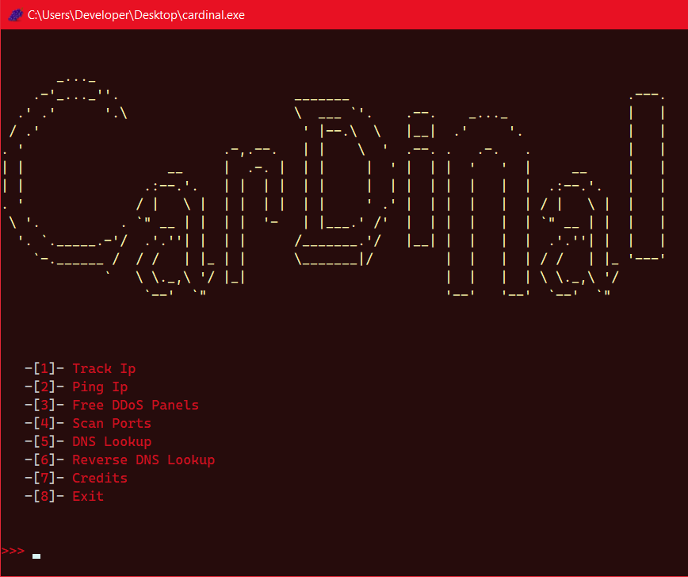

# CardinalV1
Cardinal is a public toolset developed by MagCecu#3747. It combines all the base IP tools (tracker, pinger, etc.). Cardinal is a free tool from Mag Market

  

# Compatability
It will work for both Win and Linux
If there is another problem it might be that you dont have python 3.10+ or you dont have a given module
Read instructions!

# Creators
MagCecu#3747 - Owner of the Mag Market 
inv: https://discord.gg/GFsUxKr84a

# Support
Paypal:                                                                                                                           
https://www.paypal.me/ivanedavai
